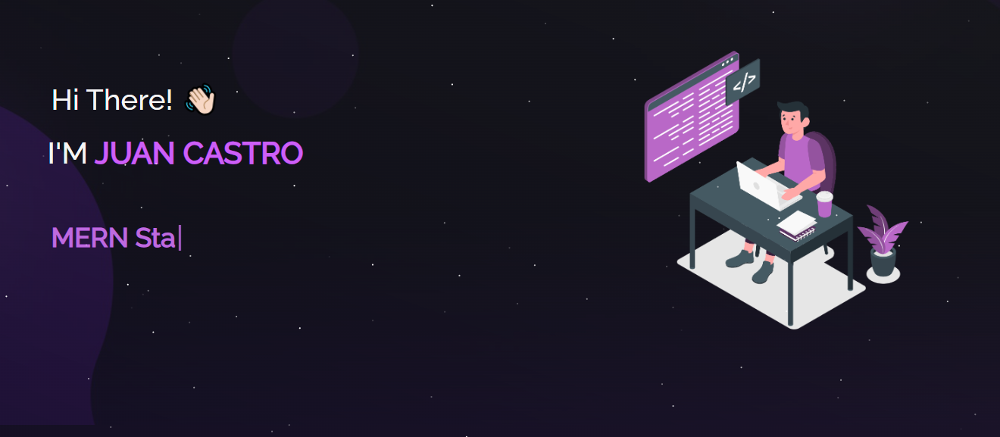

<h2 align="center">
  Portfolio Website - v1.0 
  <a href="https://mi-portfolio-juancastro.vercel.app/" target="_blank">mi-portfolio-juancastro.vercel.app</a>
</h2>

  

 

 &nbsp;
 &nbsp;
 &nbsp;
 &nbsp;

<h3 align="center">
    🔹
    <a href="https://github.com/juancastro23/mi-portfolio/issues">Report Bug</a> &nbsp; &nbsp;
    🔹
    <a href="https://github.com/juancastro23/mi-portfolio/issues">Request Feature</a>
</h3>

---

## 🚀 About

This is my personal portfolio website — **Juan Castro Portfolio v1.0**, built to showcase my projects, skills, and experience as a **Full-Stack Web & Mobile Developer**.  
It includes featured projects, a contact section, and smooth animations for a modern user experience.

---

## 🧰 Built With

This project was developed using the following technologies:

- ⚛️ React.js  
- 🟩 Node.js  
- 🎨 CSS3  
- 💻 Visual Studio Code  
- ☁️ Vercel (for deployment)

---

## ✨ Features

**📄 Multi-Page Layout**  
**🎨 Styled with React-Bootstrap and CSS — easily customizable**  
**📱 Fully Responsive Design**  
**⚡ Fast and Lightweight**  

---

## 🛠 Installation and Setup

Clone this repository and install dependencies:

1. Installation: `npm install`

2. In the project directory, you can run: `npm start`

Runs the app in the development mode.\
Open [http://localhost:3000](http://localhost:3000) to view it in the browser.
The page will reload if you make edits.

## Usage Instructions

Open the project folder and Navigate to `/src/components/`.  
You will find all the components used and you can edit your information accordingly.

### Show your support

Give a ⭐ if you like this website!

"# mi-portfolio" 
